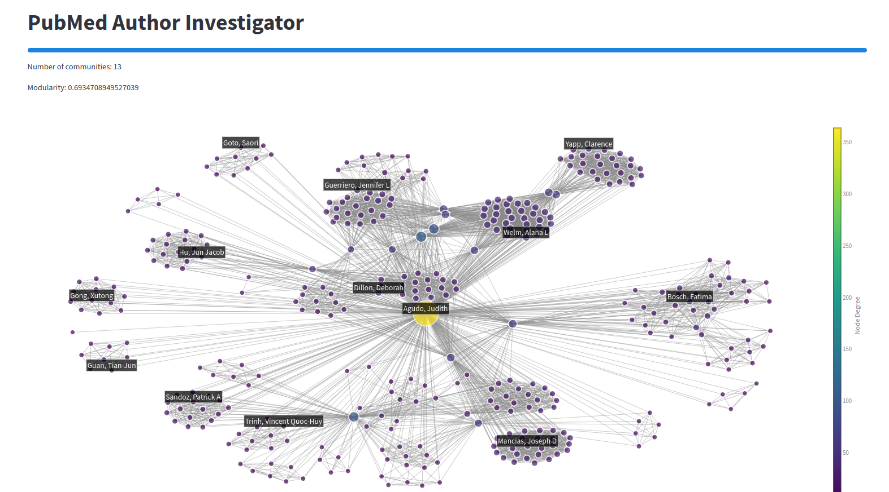
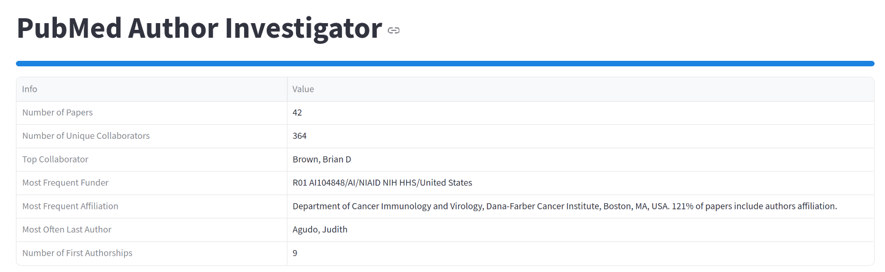

# PubMedAuthorInvestigator

This App was build using streamlit and serves as a tool to investigate authors on PubMed. It sends url requests to PubMed and evaluates the returned data. This shows the network of authors which colaborated with the author searched for:

---

This is the Summary page containing information about how many time the author first author and more:

And many more features...